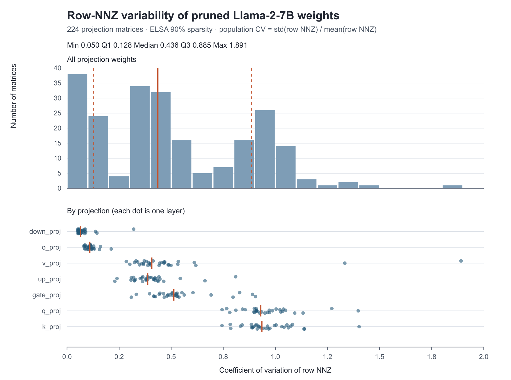

# 論文用評価データ収集計画（2026-09-30 時点）

## 研究上の主張と、旧稿から直すべき点

旧稿 `Accelerating Sparse Matrix-Vector Multiplication on Ryzen XDNA2 NPU` の要旨は Blocked-SELL-C-σ と実ELSA重みを述べる一方、本文の第III〜V章・図8〜12は行NNZが完全に一定の旧ELL実験で、結論も「不均一行は今後の課題」としている。図だけ差し替えると主張が矛盾する。新稿の中心を「実pruning重みの不均一性を、行並べ替え＋固定長ブロックで処理する」に置き、方法図・ベースライン・評価節を揃える。旧ELLの理想条件は必要なら related work/予備実験として明示し、新方式の測定値と混ぜない。

## データ集合とCV分布（取得済み）

読み取り元は ws007 の `/home/hitoshi/elsa/pruned_model/Llama-2-7b-hf_pruned0.9_admm_lr5e-05_20260301_2016`。32層×7種類（`q/k/v/o/gate/up/down_proj`）の **224個の2次元projection weight** の行別NNZを走査した。embedding/head等は除外した。全224個の密度は実測で約10%（疎率約90%）。各行列の `CV_row = std(row_nnz, ddof=0) / mean(row_nnz)` を計算した。モデル名の「ELSA 90%」はこの既存checkpointの説明であり、この走査時には再pruningしていない。



| 全224行列のCV | 最小 | Q1 | 中央値 | Q3 | 最大 |
| --- | ---: | ---: | ---: | ---: | ---: |
| 値 | 0.0503 | 0.1279 | 0.4358 | 0.8848 | 1.8909 |

各行列を1標本として数えた。分布は投影種別に強く依存する。特に`down_proj`は低CV、`q/k_proj`は高CVに偏るため、「CVで選んだ5行列の性能差＝CVだけの因果効果」と解釈してはいけない。最大CV=1.8909は次点1.4020から離れた外れ値である。

入力データは [`paper_evaluation/llama2_7b_pruned_row_cv.jsonl`](paper_evaluation/llama2_7b_pruned_row_cv.jsonl)。図は [`plot_pruned_row_cv.py`](plot_pruned_row_cv.py)、走査は [`profile_pruned_row_cv.py`](profile_pruned_row_cv.py) で再生成できる。

## 実モデルで測る5行列（暫定固定リスト）

全224行列のCV分位点に最も近いweightを一つずつ選んだ。CVだけでなく、投影種別と形状を必ず図に併記する。これらは**実モデルの代表範囲を示す標本**であって、5個の速度比の単純平均をモデル全体の推論高速化と呼ばない。

| 位置 | Weight | Shape (M×K) | 実CV |
| --- | --- | ---: | ---: |
| 最小 | `model.layers.19.mlp.down_proj.weight` | 4096×11008 | 0.0503 |
| Q1付近 | `model.layers.5.self_attn.o_proj.weight` | 4096×4096 | 0.1284 |
| 中央値付近 | `model.layers.11.mlp.up_proj.weight` | 11008×4096 | 0.4376 |
| Q3付近 | `model.layers.18.self_attn.k_proj.weight` | 4096×4096 | 0.8845 |
| 最大 | `model.layers.0.self_attn.v_proj.weight` | 4096×4096 | 1.8909 |

最大値は特異なので、余裕があれば95パーセンタイル付近の `model.layers.6.self_attn.k_proj.weight`（CV=1.0623）も測り、最大値だけで結論が決まっていないかを確認する。同じ形状だけでCV効果を見たい場合は、次節の合成行列を使用する。なお、全224行列の中央値CV≈0.44は **4096×4096の128行列だけの中央値≈0.77ではない**。形状を固定した合成実験でCV≈0.44を使うときは「全projectionの中央値に基づく制御条件」であり、「4096×4096重みの典型値」とは呼ばない。

## 主評価の共通条件

- 同一のCSR行列・BF16入力ベクトルから **Dense K-tiled GEMV、固定幅ELL、Blocked Slice-ELL（行順維持）、Blocked SELL-C-σ（行並べ替え＋専用reorder core）** の4方式を比較する。ELLは既存の32行縦方向ブロックカーネルを使うため、4本はデータ形式だけでなくkernel/コア配分も異なる「実装方式の比較」である。SELL-C-σは現行実装の `B_h=6, B_w=256, 8 windows, 8 columns, 3 compute + 1 reorder core/column`、Slice-ELLも `B_h=6, B_w=256, 8 columns` に固定する。測定点ごとの自動チューニングは行わない。
- **各行列・各方式で最初に2回連続warmup → 5回連続計測し、次の行列・方式に移る前に4秒待機**とする。5個の生sampleを保存し、その平均を当該行列・方式の代表時間とする。速度比は同じ行列・同じseedについて `mean(Denseの5回) / mean(比較方式の5回)` と計算する。ケース間の待機は `result.npu_time` に含めない。これは短い連続burstを測り、ケース間に熱緩和の時間を入れる方式であり、kernel切り替えやLLMの実トークン間隔の再現ではない。旧 `measure.py` の「毎sample前2 warmup + 4秒待機」とも異なる**統一プロトコル**である。ダミーカーネル交互dispatchは主評価に入れない。
- 当初の「各sample前1秒待機」は下記の健康診断で系統的な数ms級外れ値が生じたため、**全条件に一律に**上のプロトコルへ変更した。軽い/重い代表ケースで5 sampleの安定性と先後の再測定差を確認する。温度・clockが取得可能なら併記する。全体に不安定さが再発したら全方式・全行列を同じ条件で取り直す。孤立した1組だけが事前の品質判定「5 sampleの最大値 > 中央値の2倍」に抵触した場合は、**その組のみ同一条件で1回再測定**し、元の生データと再測定データの両方・差し替え理由を保存する。再測定も不安定なら都合のよい値を選ばず原因調査へ戻る。計測順序と日時を生レコードに残す。
- 合成条件ごとに**独立した10 seed**を使い、本測定のseed集合は `1000..1009`、事前検証は別seed `999`、入力ベクトルは固定の `x_seed=3000` とする。各seedで生成した行列と `x` を4方式で共有する。異なる密度/CV条件でも同じseed集合を用いるが、異なる条件の行列が要素ごとに対応するとは主張しない。方式の実行順序はseedごとに循環させ、長時間測定の温度・clock変動が常に同じ方式へ偏らないようにする。箱ひげ図の1標本は「1行列の5回平均から得た速度比」であり、50回のdispatchを独立な50行列として数えない。10点の実測値を箱の上にも重ねる。
- 全方式の出力を同一CSR/FP32蓄積→BF16のCPU参照と元の行順で照合する。現行ELL経路には一定数の数値許容例を通す処理があるため、`ok_with_tolerance_exceptions` を厳密一致と読み替えない。許容誤差・例外件数を記録し、許容範囲外のケースを主速度図へ黙って入れない。packing、compile、host BO copyと `result.npu_time` を混ぜない。
- 既存ELLの32-core経路は全形状・全CV/密度でのL1配置、出力FIFO、コンパイル成立を保証しない。まず各条件を1 seedでCPU/NPU事前検証し、失敗した方式・条件は理由を記録して速度を `N/A` とする。**容量比からELLの実測時間を推定しない。** 成功した点だけを速度図へ載せ、方式ごとに異なる有効seed数をキャプションに明記する。失敗したseedを都合よく再抽選しない。
- 測定は同じws007 NPUで行い、電力・clock設定、driver/XRT、firmware、mlir-aie版、branch/commit、seed集合、スクリプト版を記録する。生レコードには checkpoint/tensor名または合成生成条件、M/K/NNZ/実CV、行NNZの最大値・分位点、CSR/x hash、方式/`B_h,B_w,windows,columns`、パックA/row-map/control/x/y byte、5個の時間、数値照合結果と失敗理由を残す。
- 図の「保存容量」はDense BF16 Aに対する `packed A + formatに必須のrow-map/control` の比率とし、内訳も保存する。`x` と `y` はモデルの重み保存容量へ混ぜない。一方、`(実際に転送したA + x + control + map + y) / NPU時間` は**論理転送byteに基づく実効帯域**として別名で扱い、DRAM物理カウンタの実測値とは呼ばない。xの初回転送と再利用の有無も実装ごとに確認する。

## 合成行列の共通生成規則と二つのスイープ

実重み224行列はいずれもほぼ10%非ゼロなので、密度の影響は合成行列で評価する。形状は `M=K=4096`、行内の非ゼロ列位置と非ゼロ値はseed付き乱数、値と入力 `x` はBF16とする。同じseed/条件の**同じ行列**を4方式へ渡す。現行の合成CV生成経路は旧ELLのBF16部分和丸めによる符号相殺誤差を避けるため、**非ゼロ値と `x` が正値**である。この実験は行NNZ分布と容量/性能の制御実験であり、実重みの符号・値分布を模したものとは書かない。densityはここでは非ゼロ率 `NNZ/(M×K)` を指す。論文の「sparsity（ゼロ率）」と取り違えないよう、図の横軸にも非ゼロ率と明記する。

生成器へCVを指定しただけでは最終行列のCVは固定されない。現行のlog-normal生成器は高密度で各行の上限 `K` にクリップされ、目標CV≈0.436・非ゼロ率50%でも実CV≈0.398となる。生成器の潜在分散を調整し、**クリップ・整数丸め・総NNZ合わせ後の実CV**を目標へ合わせる。密度は指定値に対し総NNZを丸めた1要素以内、実CVは目標の±5%以内を事前の採用条件とする。達成できない条件は無理に採用せず、目標・実CV・原因を記録する。10 seedすべてで実CV、総NNZ、行NNZ最大値、ELL幅、パック容量をNPU実行前に検査する。CVは行NNZの母標準偏差/平均で計算する。

| 実験 | 固定する条件 | 振る条件 | 根拠 |
| --- | --- | --- | --- |
| 非ゼロ率スイープ | 行NNZの実CV≈**0.44**、4096×4096、各方式の設定 | 非ゼロ率 **5, 10, 20, 30, 40, 50%** | CV≈0.44は全224実重みの中央値。10%は実ELSA重みと一致し、5〜50%で疎形式が有利な領域から容量/速度の逆転域まで確認する。高密度点をLLM重みの代表とは呼ばない。 |
| CVスイープ | 非ゼロ率 **10%**、4096×4096、各方式の設定 | 実CV≈**0.05, 0.13, 0.44, 0.88, 1.06, 1.89** | 実ELSA重み224個の最小・Q1・中央値・Q3・約95パーセンタイル・最大に対応する。最大1.89は外れ値なので、その手前の1.06を挟む。 |

交点は「10%非ゼロ、CV≈0.44」の1条件で共用し、**計11条件×10 seed＝110合成行列**、4方式が全点で成立すれば最大440方式・行列の実測組となる。先に各条件1 seedで生成可能性・メモリ配置・コンパイル・数値一致を確かめ、その後に事前固定した10 seedの本測定へ進む。最小CV≈0.05は4096×11008の実重み由来で、4096×4096実重みの最小値ではない。このスイープは**形状を固定して、全projectionで観測したCV範囲を探索する対照実験**と記述する。行NNZが0～Kに限られると、非ゼロ率 `d` でのCV上限は `sqrt((1-d)/d)`。最大CV≈1.89は非ゼロ率10%では理論上可能（上限3）だが、50%では不可能（上限1）なので、全CVを全密度へ掛け合わせない。

### 測定開始前の実装差分（2026-09-30 実装済み）

以下の差分を実装した。全論文用結果の収集・原稿への反映が完了したという意味ではない。

1. `matrix_preparation.py`: `row_pattern="cv_calibrated"` を追加し、固定した行乱数に対する潜在log-normal幅を二分探索する。**クリップ・整数丸め・総NNZ合わせ後の実CV**を目標へ合わせ、到達しないときはエラーとする。旧 `row_pattern="cv"` は振る舞いを変えずに残す。
2. `run_test()`: **NPU実行と時間収集はここだけ**に置き、既定値0秒の `idle_s` を追加した。連続warmup後と各計測の前に待つ。待機は `result.npu_time` に含めない。旧 `measure.py` の `_run()` は呼び出さない。
3. `matrix_measure.py` の `make_case()` / `measure_case()`: **ELLを含む4方式の共通計測**を担い、2 warmup・5 timedの連続実行を `run_test()` へ渡す。ELLのみBF16部分和丸めの許容例を件数付きで別扱いする。保存容量は `packed A + 必須制御/row-map` とし、制御stream中に複製された `x` は除外する。実転送の `x` byteは別欄に残す。
4. 測定ドライバ `measure_paper.py`: `synthetic` は11条件×10 seed、`synthetic --preflight` は別seed 999、`synthetic --profile-only` はNPUなしで全行プロファイルを検査する。`real` はCV分位点の実重み5行列を選ぶ。両方とも `matrix_preparation.py` で1件ずつCSR/xを用意し、`matrix_measure.py` の同じ `measure_case()` を呼ぶ。日時・順序・5 sample・hash・失敗理由・software provenanceをJSONLに残す。合成本測定は既存JSONLの完了済み組をスキップして再開できる。
5. `plot_paper_results.py` は**同じ行列のDense**とペアにして速度比を計算し、CSV・有効seed数/失敗一覧のMarkdown・主図のSVG/PNGを生成する。1点は5 sample平均であり、失敗点から速度を推定しない。

ケース間4秒待機は合成440組すべてが成立すれば439箇所で**約29分**かかる。コンパイル・生成・packing等は別途必要。この時間を実行予定に含める。実装は完了したが、本書に未測定の速度予測値は書かない。

### 実行順序・再現コマンド

以下はリポジトリrootを作業ディレクトリとし、既存のmlir-aie/XRT/PyTorch/safetensors環境を有効にした場合。`PYTHONPATH` にリポジトリrootを含める。描画側にはNumPyとMatplotlibが必要で、NPUは不要。`measure_paper.py` は論文条件が既定値で、`--paper` は不要。実重み・合成とも `measure_case()` → `run_test()` で共通である。

```bash
python -m iron.operators.spmv.measure_paper synthetic --profile-only
python -m iron.operators.spmv.measure_paper synthetic --preflight
python -m iron.operators.spmv.measure_paper real /path/to/pruned_checkpoint
python -m iron.operators.spmv.measure_paper synthetic
python -m iron.operators.spmv.plot_paper_results
```

`matrix_preparation.py` は実重み・合成行列を同じ `CSRMatrix`/BF16 `x` にするCPU側のモジュールで、NPU計測の `main()` は持たない。`matrix_measure.py` は1行列×1方式の `make_case()`/`measure_case()` を持つ共通部品で、実験対象のリストやCLIは持たない。唯一の論文測定CLI `measure_paper.py` が `real` または `synthetic` を選び、行列を1件ずつ共通部品へ渡す。既存のJSONL/CSV/図はこの改名で再測定せず、元の内容を保つ。

孤立外れ値の再測定は、例えば `python -m iron.operators.spmv.measure_paper synthetic --condition cv_1.89 --paper-seed 1006 --design sell_dedicated_reorder --output-jsonl /別の保存先/synthetic_corrections.jsonl` とし、元JSONLを上書きしない。描画時は `--synthetic-corrections` でその別ファイルを指定する。描画器がCSR・x・行NNZ・format・計測プロトコルの同一性、元データの外れ値判定、再測定の安定性を確認し、派生CSV/図だけへ反映する。両方の5 sampleは `figures/timing_correction_audit.md` に併記する。

入力が大きく実行時間も長いため、事前確認は `measure_paper synthetic --preflight --condition density_10` のように1条件へ限定可能。本測定も `measure_paper synthetic --condition cv_1.89` のように分割実行して同じJSONLへ追記できる。既定の出力は `paper_evaluation/real_weights_w2_t5_idle0s_between4s.jsonl`、`synthetic_paper_w2_t5_idle0s_between4s.jsonl`、`figures/`。時間プロトコルを変えた場合はファイル名にも反映され、再開キーも別になる。`--profile-only` と `--preflight` は別JSONLを用いる。結果と図を**論文へ採用する前に**、各JSONLの全方式・全seedの完了件数、5 sample、環境欄、温度/clock変動、失敗点を確認する。描画スクリプトは5 sample中に中央値の2倍を超える外れ値、または途中までのJSONLを図として採用することを既定で拒否する。診断だけなら `--allow-partial` で途中図を作れるが論文には使用しない。2026-09-30の隔離検証では110生成プロファイルの目標CV/NNZが成立し、11条件×4方式の事前NPU実行・CPU照合が44/44で成功した。この事前実行は**1 timed sample・待機0秒**であり論文の速度値には使わない。

## 図と実験の優先順位

### 必須1: 実モデルのCV範囲と、5行列の主比較

上のCV分布図をデータ集合・代表選定の根拠として使う。選んだ5行列で同じ入力を4方式へ通し、論文の主結果は「各行列のDense比実測speedup」と「Dense比の実保存容量」を**別パネル**に描く。横軸にはCV順のweight名＋shape/投影種別を示す。Slice-ELL対SELL-C-σの差も直接計算する。ELLの実行不可は `N/A` とし、容量のみを示す。容量差が小さい行列ではreorder overheadでSELLが必ず勝つわけではない、と正直に示す。5行列の速度比の平均をモデル全体の推論高速化と呼ばない。

### 必須2: 非ゼロ率スイープとCVスイープ（旧図8・9を置換）

上の11条件を同一測定プロトコルで実行し、**二つのグラフ**を作る。非ゼロ率スイープはCV≈0.44の6点、CVスイープは非ゼロ率10%の6点で、中心条件を共有する。主パネルは4方式の `Dense時間 / 当該方式時間` のseed間箱ひげ図＋全10点、補助パネルは実行時間と保存容量/Dense容量を同じ条件で示す。箱ひげの分布はランダム行列間の変動であり、1行列内の5回dispatchの測定ノイズとは分ける。実CVのseed間範囲もcaptionまたは補助表に載せる。容量比も10行列ごとに算出し、同じ10点を集計する。

最大CV=1.89は稀な実重みを代表する**端点**であり、それが不成立でも捨ててグラフを滑らかにしない。高CVでELLだけ実行できないならその条件に `N/A` を残し、他3方式の実測とELL容量を示す。**実モデル5行列ではCVと形状・投影種別が交絡するため、固定形状/密度のCVスイープがCVの影響を切り分ける。** 逆に、固定CVの非ゼロ率スイープが密度の影響を切り分ける。両者の交互作用を全範囲で推定したとは主張しない。

### 推奨3: 圧縮率と実測速度比の関係（追加のNPU測定なし）

11条件の同じ結果を再利用し、横軸を実保存容量/Dense容量、縦軸をDense/各疎形式の実測時間比とする散布図を作る。色を非ゼロ率、記号を方式またはCV条件にして、容量削減が実行時間削減に結び付く範囲と、起動・制御・reorder等で乖離する範囲を示す。実重み5行列は形状が違うため、同じ回帰線へ無批判に混ぜず、別記号/別パネルで示す。論理実効帯域を論じる場合は使用byteの定義と時間を同じ図または表で確認する。

### 余裕があれば4: コア数とデータ量（旧図10〜12を再設計）

- コア数: 現行SELL-C-σ operatorは**1列または8列のみ**を受け付け、既存の「1列測定」は8列にpackした各列の部分行列を切り出した試験で、同一`M×K`全体を1/2/4/8列で再計算した強いスケーリングではない。したがって旧図10をそのままSELL版へ置換しない。2/4列へ拡張・CPU照合が期限内に可能なら、同一行列を毎回再packして1/2/4/8列を比較し、物理core数と計算core数（1列あたり3＋reorder1）を両方表記する。無理ならこの図は削るか、1列対8列の**異なる問題量の診断**と正確に記す。
- 実効帯域と総入出力byte: 旧図12の意味を残すなら、密度・CV・Kを固定しMだけを増やした合成行列を複数用意する。xと出力を含む論理転送byteで帯域を計算し、時間対byteも併記して固定費と傾きが見えるようにする。実モデル5点のみではshapeやCVが違い、総byteの効果を分離できない。旧図11の20倍高行列はELLの極端な高疎率で固定費を示すための図なので、新稿の主張に必須ではない。

## 工程と打ち切り基準

1. **取得済み:** 224行列のCV分布図とJSONL。図のcaptionに「32層×7投影・各行列1標本・行NNZの母CV・全行列ほぼ10%非ゼロ」を明記する。
2. 11合成条件の1 seed事前検証。生成後CVの較正、ELLを含む4方式の配置・コンパイル・CPU照合、保存容量算出を済ませる。ここで成立条件と事前固定seed集合を確定し、性能を見てからseedを選ばない。
3. 5実行列の4方式を **2 warmup + 5 timed** で再測定し、出力一致・生sample・容量を一つの結果表へ記録。失敗方式は理由を表に残し、無理な代替kernelを黙って混ぜない。
4. 合成11条件×10 seedを同一プロトコルで計測し、二つの箱ひげ図と容量パネルを作る。CV=1.89やELLの失敗を含め、有効seed数を表示する。全条件が成立した場合のみ440方式・行列組となる。
5. 同じ生レコードから圧縮率対速度比の散布図を作る。コア数1/2/4/8の新operator対応、サイズ/帯域図は最後に判断し、できなければ旧稿の対応図を外す。
6. 図から本文を書き直す。旧稿の要旨・方法・評価・結論と表の環境バージョンを一致させ、各グラフに測定集合・warmup/timed回数・速度比の分子/分母・byte計上・有効seed数を記載する。

期限が厳しければ、**CV分布＋5実行列の容量/速度＋合成11条件の二つの主図**を優先し、圧縮率対速度比は同じデータから後で描く。コア数と帯域の新規測定は削る。未実装の強いスケーリングを示すより、主張と測定の一致を優先する。

## 測定プロトコルの健康診断（2026-09-30、主図へは未採用）

1秒間隔で実重み5行列×4方式を試したところ、成立19組のうち10組で**5 sample目だけ**中央値の2倍を超える追加遅延が出た。合成の途中43組でも20組に同じ現象があり、本測定を中断した。生データは `paper_evaluation/real_weights.jsonl` と `paper_evaluation/synthetic_paper_1s_diagnostic.jsonl` に保存した。これらの5回平均を上の主図には使わない。

同一Denseカーネル・同一4096×4096合成行列で `2 warmup + 12 timed` を比較すると、待機0秒では全12 sampleが約760–766 µs、1秒間隔では6番・12番が約3423/3369 µs、その他は約792–823 µsだった。**1秒間隔と数秒周期の追加遅延の相関は確認したが、その発生源（XRT・OS・NPU電源管理など）は未特定**である。単に5回平均を報告すると方式・行列ごとに追加遅延の混入有無が違い、公正な比較にならない。そこで主評価を「2 warmup＋5 timed連続、ケース間4秒待機」へ全条件で切り替えた。代表3方式の5 sampleおよび取り直した実重み19成立組は、上記の数ms級突出を示さなかった。ただし全合成条件でも引き続き生sampleを確認する。

## 本測定の完了状況と孤立外れ値の処理

- 上記の統一プロトコルで、実重み5行列×4方式の20組、合成11条件×10 seed×4方式の440組を実行した。実重みは18組が通常成功、1組のELLが数値許容例付き成功、1組（L11 `up_proj` のELL）は32-core経路の形状制約で実行不可。合成440組は全てCPU照合まで成功した。行NNZの目標CV相対誤差の最大は約0.002%。実重みの不可組は速度を `N/A` にする。
- 合成440組の生sample品質検査では439組が中央値2倍以内で、`cv_1.89` / seed `1006` / `sell_dedicated_reorder` のみ `[938.093, 327.187, 290.419, 292.148, 289.508]` µs（平均427.471 µs）だった。この1組だけ同じCSR・x・format・計測プロトコルで**一度だけ**再測定し、`[322.676, 312.066, 287.734, 289.214, 291.054]` µs（平均300.549 µs）となった。元の外れ値は再現しなかった。発生源は特定しておらず、誤測定と断定しない。
- 元の440組は `paper_evaluation/synthetic_paper_w2_t5_idle0s_between4s.jsonl` に変更せず保存し、再測定1組を `paper_evaluation/synthetic_corrections.jsonl` に分離した。図と派生CSVのみ再測定値を適用し、変更箇所は `figures/timing_correction_audit.md` に残す。再測定を都合よく選び直す追加試行はしていない。1秒間隔の旧診断データは引き続き主図へ採用しない。
